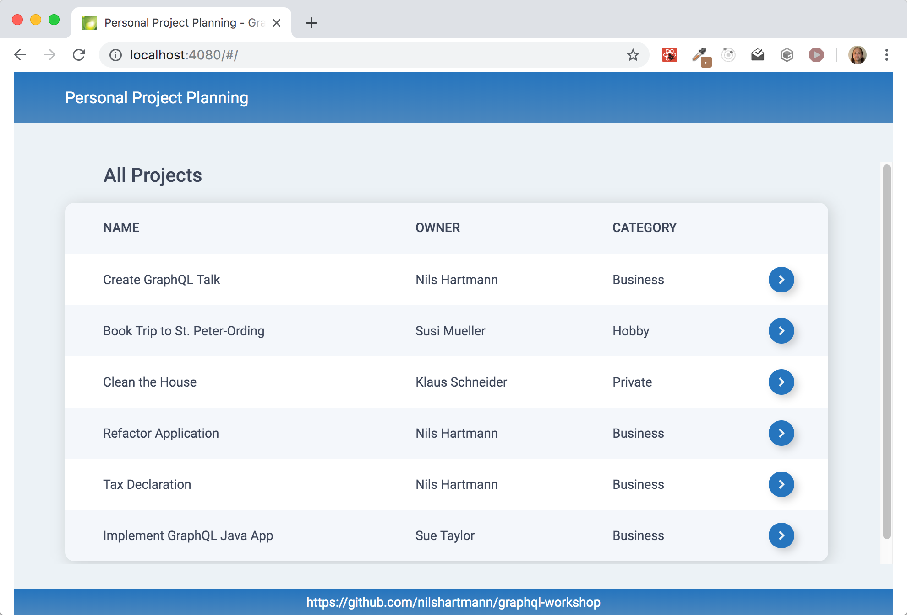

# GraphQL Workshop

Dieses Repository enthält die Unterlagen und Code-Beispiele für meinen GraphQL Workshop.

# Vorbereitung

## Schritt 1: Repository klonen

Bitte klone dieses Repository

```
git clone https://github.com/nilshartmann/graphql-workshop
```

## Schritt 2: Installieren der Pakete

Installiere dann die erforderlichen npm-Pakete für die Beispiel-Anwendung bzw. die Übungen:

```
cd graphql-workshop/code-backend

npm install
```

und

```
cd graphql-workshop/code-frontend/workspace

npm install
```

# Interessiert an Trainings?

Ich biete sowohl öffentliche als auch individuelle In-House-Trainings für React, TypeScript und GraphQL an.
Mehr Informationen dazu findest Du [hier](https://nilshartmann.net/react-workshops)

# Kontakt

- [Nils Hartmann](https://nilshartmann.net)
- [Twitter](https://twitter.com/nilshartmann)
- [Xing](https://www.xing.com/profile/Nils_Hartmann2)

# Beispiel Anwendung


