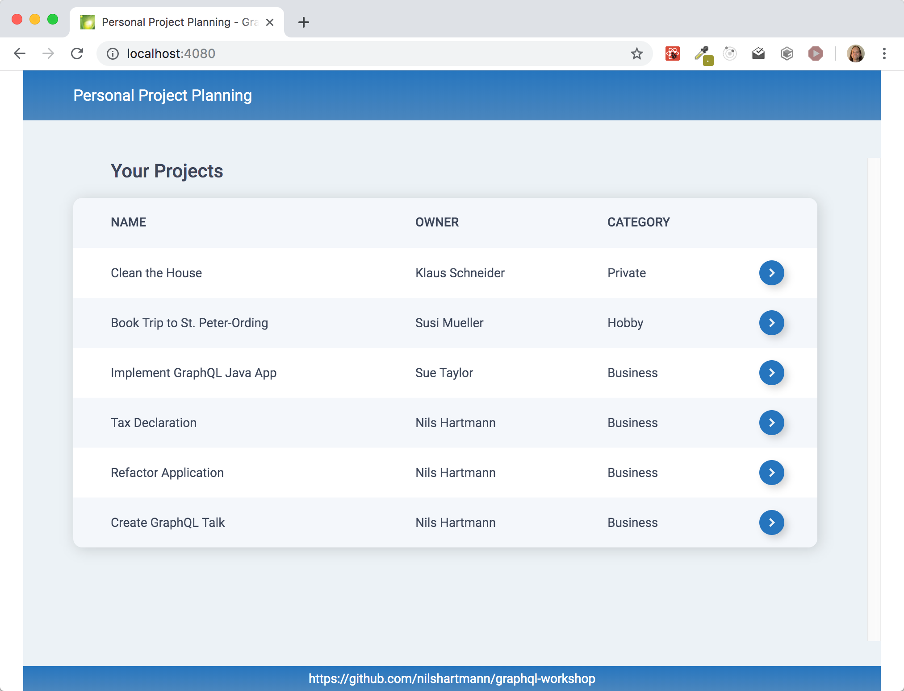

# Apollo GraphQL "Fullstack" Example Application

Complete an final step.

Including:
* backend
* postgres
* optimized db access (JOINs per GraphQL Query)
* caching via nging

## Processes and Ports

| Process     | Started by | Port |
| ----------- | ---------- | ---- |
| userservice | yarn       | 4010 |
| backend     | yarn       | 4000 |
| frontend    | yarn       | 4080 |
| postgres    | docker     | 4432 |
